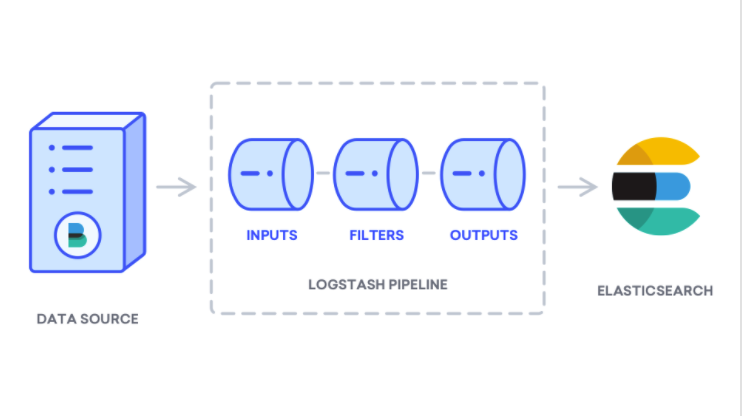

# ELK installation Ubuntu 18.04

### Elastic search installation 

Java Installation
```
sudo apt update
sudo apt install openjdk-8-jdk
```
Install Nginx
```
sudo apt update
sudo apt install nginx
sudo ufw allow 'Nginx HTTP'
```

Elastic Search
```
sudo apt install apt-transport-https
wget https://artifacts.elastic.co/downloads/elasticsearch/elasticsearch-7.9.2-amd64.deb
wget https://artifacts.elastic.co/downloads/elasticsearch/elasticsearch-7.9.2-amd64.deb.sha512
shasum -a 512 -c elasticsearch-7.9.2-amd64.deb.sha512 
sudo dpkg -i elasticsearch-7.9.2-amd64.deb
```

Start Elasticsearch Service
```
sudo systemctl daemon-reload
sudo systemctl enable elasticsearch.service
sudo systemctl start elasticsearch.service
```

Test
```
curl localhost:9200
```

Allow Remote Access
```
sudo vim /etc/elasticsearch/elasticsearch.yml
```

Insert the following:
```
transport.host: localhost
transport.tcp.port: 9300
http.port: 9200
network.host: 0.0.0.0
```

Restart service
```
sudo systemctl restart elasticsearch.service
```

### Kibana installation
```
wget https://artifacts.elastic.co/downloads/kibana/kibana-7.9.2-amd64.deb
wget https://artifacts.elastic.co/downloads/kibana/kibana-7.9.2-amd64.deb.sha512
sudo dpkg -i kibana-7.9.2-amd64.deb
```

Enable
```
sudo systemctl enable kibana
sudo systemctl start kibana
```

Create User password
```
echo "kibanaadmin:`openssl passwd -apr1`" | sudo tee -a /etc/nginx/htpasswd.users
```

Modify nginx configuration
```
sudo nano /etc/nginx/sites-available/sunserver.site
```

Insert:
```
server {

        server_name sunserver.site elk.sunserver.site;

        auth_basic "Restricted Access";
        auth_basic_user_file /etc/nginx/htpasswd.users;

        location / {
        proxy_pass http://localhost:5601;
        proxy_http_version 1.1;
        proxy_set_header Upgrade $http_upgrade;
        proxy_set_header Connection 'upgrade';
        proxy_set_header Host $host;
        proxy_cache_bypass $http_upgrade;
        }

    listen [::]:443 ssl ipv6only=on; # managed by Certbot
    listen [::]:443 ssl ipv6only=on; # managed by Certbot
    listen 443 ssl; # managed by Certbot
    ssl_certificate /etc/letsencrypt/live/sunserver.site/fullchain.pem; # managed by Certbot
    ssl_certificate_key /etc/letsencrypt/live/sunserver.site/privkey.pem; # managed by Certbot
    include /etc/letsencrypt/options-ssl-nginx.conf; # managed by Certbot
    ssl_dhparam /etc/letsencrypt/ssl-dhparams.pem; # managed by Certbot


}
server {
    if ($host = elk.sunserver.site) {
        return 301 https://$host$request_uri;
    } # managed by Certbot


    if ($host = sunserver.site) {
        return 301 https://$host$request_uri;
    } # managed by Certbot


        listen 80;
listen [::]:80;

        server_name sunserver.site elk.sunserver.site;
    return 404; # managed by Certbot


}
```

Create simbolic link to sites-enabled

```
sudo ln -s /etc/nginx/sites-available/sunserver.site /etc/nginx/sites-enabled/sunserver.site
```

Check errors
```
sudo nginx -t
```

Restart nginx 
```
sudo systemctl restart nginx
```

Enable firewall
```
sudo ufw allow 'Nginx Full'
```

Installing and Configuring Logstash
Although it’s possible for Beats to send data directly to the Elasticsearch database, we recommend using Logstash to process the data. This will allow you to collect data from different sources, transform it into a common format, and export it to another database.



Create a configuration file called 02-beats-input.conf where you will set up your Filebeat input:
```
sudo vim /etc/logstash/conf.d/02-beats-input.conf
```
Insert the following input configuration. This specifies a beats input that will listen on TCP port 5044.
```
/etc/logstash/conf.d/02-beats-input.conf
input {
  beats {
    port => 5044
  }
}
```
Save and close the file. Next, create a configuration file called 10-syslog-filter.conf, where we will add a filter for system logs, also known as syslogs:

```
sudo vim /etc/logstash/conf.d/10-syslog-filter.conf
```

insert the following filter :  This example system logs configuration was taken from official Elastic documentation. This filter is used to parse incoming system logs to make them structured and usable by the predefined Kibana dashboards:
```
filter {
  if [fileset][module] == "system" {
    if [fileset][name] == "auth" {
      grok {
        match => { "message" => ["%{SYSLOGTIMESTAMP:[system][auth][timestamp]} %{SYSLOGHOST:[system][auth][hostname]} sshd(?:\[%{POSINT:[system][auth][pid]}\])?: %{DATA:[system][auth][ssh][event]} %{DATA:[system][auth][ssh][method]} for (invalid user )?%{DATA:[system][auth][user]} from %{IPORHOST:[system][auth][ssh][ip]} port %{NUMBER:[system][auth][ssh][port]} ssh2(: %{GREEDYDATA:[system][auth][ssh][signature]})?",
                  "%{SYSLOGTIMESTAMP:[system][auth][timestamp]} %{SYSLOGHOST:[system][auth][hostname]} sshd(?:\[%{POSINT:[system][auth][pid]}\])?: %{DATA:[system][auth][ssh][event]} user %{DATA:[system][auth][user]} from %{IPORHOST:[system][auth][ssh][ip]}",
                  "%{SYSLOGTIMESTAMP:[system][auth][timestamp]} %{SYSLOGHOST:[system][auth][hostname]} sshd(?:\[%{POSINT:[system][auth][pid]}\])?: Did not receive identification string from %{IPORHOST:[system][auth][ssh][dropped_ip]}",
                  "%{SYSLOGTIMESTAMP:[system][auth][timestamp]} %{SYSLOGHOST:[system][auth][hostname]} sudo(?:\[%{POSINT:[system][auth][pid]}\])?: \s*%{DATA:[system][auth][user]} :( %{DATA:[system][auth][sudo][error]} ;)? TTY=%{DATA:[system][auth][sudo][tty]} ; PWD=%{DATA:[system][auth][sudo][pwd]} ; USER=%{DATA:[system][auth][sudo][user]} ; COMMAND=%{GREEDYDATA:[system][auth][sudo][command]}",
                  "%{SYSLOGTIMESTAMP:[system][auth][timestamp]} %{SYSLOGHOST:[system][auth][hostname]} groupadd(?:\[%{POSINT:[system][auth][pid]}\])?: new group: name=%{DATA:system.auth.groupadd.name}, GID=%{NUMBER:system.auth.groupadd.gid}",
                  "%{SYSLOGTIMESTAMP:[system][auth][timestamp]} %{SYSLOGHOST:[system][auth][hostname]} useradd(?:\[%{POSINT:[system][auth][pid]}\])?: new user: name=%{DATA:[system][auth][user][add][name]}, UID=%{NUMBER:[system][auth][user][add][uid]}, GID=%{NUMBER:[system][auth][user][add][gid]}, home=%{DATA:[system][auth][user][add][home]}, shell=%{DATA:[system][auth][user][add][shell]}$",
                  "%{SYSLOGTIMESTAMP:[system][auth][timestamp]} %{SYSLOGHOST:[system][auth][hostname]} %{DATA:[system][auth][program]}(?:\[%{POSINT:[system][auth][pid]}\])?: %{GREEDYMULTILINE:[system][auth][message]}"] }
        pattern_definitions => {
          "GREEDYMULTILINE"=> "(.|\n)*"
        }
        remove_field => "message"
      }
      date {
        match => [ "[system][auth][timestamp]", "MMM  d HH:mm:ss", "MMM dd HH:mm:ss" ]
      }
      geoip {
        source => "[system][auth][ssh][ip]"
        target => "[system][auth][ssh][geoip]"
      }
    }
    else if [fileset][name] == "syslog" {
      grok {
        match => { "message" => ["%{SYSLOGTIMESTAMP:[system][syslog][timestamp]} %{SYSLOGHOST:[system][syslog][hostname]} %{DATA:[system][syslog][program]}(?:\[%{POSINT:[system][syslog][pid]}\])?: %{GREEDYMULTILINE:[system][syslog][message]}"] }
        pattern_definitions => { "GREEDYMULTILINE" => "(.|\n)*" }
        remove_field => "message"
      }
      date {
        match => [ "[system][syslog][timestamp]", "MMM  d HH:mm:ss", "MMM dd HH:mm:ss" ]
      }
    }
  }
}
```

Lastly, create a configuration file called 30-elasticsearch-output.conf:
```
sudo vim /etc/logstash/conf.d/30-elasticsearch-output.conf
```

insert the following
```
output {
  elasticsearch {
    hosts => ["localhost:9200"]
    manage_template => false
    index => "%{[@metadata][beat]}-%{[@metadata][version]}-%{+YYYY.MM.dd}"
  }
}
```

If you want to add filters for other applications that use the Filebeat input, be sure to name the files so they’re sorted between the input and the output configuration, meaning that the file names should begin with a two-digit number between 02 and 30.

Test your Logstash configuration with this command:
```
sudo -u logstash /usr/share/logstash/bin/logstash --path.settings /etc/logstash -t
```

If there are no syntax errors, your output will display Configuration OK after a few seconds. If you don’t see this in your output, check for any errors that appear in your output and update your configuration to correct them.

If your configuration test is successful, start and enable Logstash to put the configuration changes into effect:
```
sudo systemctl start logstash
sudo systemctl enable logstash
```

Installing and Configuring Filebeat
 
The Elastic Stack uses several lightweight data shippers called Beats to collect data from various sources and transport them to Logstash or Elasticsearch. Here are the Beats that are currently available from Elastic:

Filebeat: collects and ships log files.
Metricbeat: collects metrics from your systems and services.
Packetbeat: collects and analyzes network data.
Winlogbeat: collects Windows event logs.
Auditbeat: collects Linux audit framework data and monitors file integrity.
Heartbeat: monitors services for their availability with active probing.
In this tutorial we will use Filebeat to forward local logs to our Elastic Stack.

Install Filebeat using apt:
```
sudo apt install filebeat
```
Next, configure Filebeat to connect to Logstash. Here, we will modify the example configuration file that comes with Filebeat.

```
Note: As with Elasticsearch, Filebeat’s configuration file is in YAML format. This means that proper indentation is crucial, so be sure to use the same number of spaces that are indicated in these instructions.
```

Open the Filebeat configuration file:
```
sudo vim /etc/filebeat/filebeat.yml
```
Filebeat supports numerous outputs, but you’ll usually only send events directly to Elasticsearch or to Logstash for additional processing. In this tutorial, we’ll use Logstash to perform additional processing on the data collected by Filebeat. Filebeat will not need to send any data directly to Elasticsearch, so let’s disable that output. To do so, find the output.elasticsearch section and comment out the following lines by preceding them with a #:

```
...
#output.elasticsearch:
  # Array of hosts to connect to.
  #hosts: ["localhost:9200"]
...
```
Save and close the file.

The functionality of Filebeat can be extended with Filebeat modules. In this tutorial we will use the system module, which collects and parses logs created by the system logging service of common Linux distributions.

Let’s enable it:
```
sudo filebeat modules enable system
```
You can see a list of enabled and disabled modules by running:
```
sudo filebeat modules list
```
You will see a list similar to the following:
```
Enabled:
system

Disabled:
activemq
apache
auditd
aws
azure
barracuda
bluecoat
cef
checkpoint
cisco
coredns
crowdstrike
cylance
elasticsearch
envoyproxy
f5
fortinet
googlecloud
gsuite
haproxy
ibmmq
icinga
iis
imperva
infoblox
iptables
juniper
kafka
kibana
logstash
microsoft
misp
mongodb
mssql
mysql
nats
netflow
netscout
nginx
o365
okta
osquery
panw
postgresql
rabbitmq
radware
redis
santa
sonicwall
sophos
squid
suricata
tomcat
traefik
zeek
zscaler
```

By default, Filebeat is configured to use default paths for the syslog and authorization logs. In the case of this tutorial, you do not need to change anything in the configuration. You can see the parameters of the module in the /etc/filebeat/modules.d/system.yml configuration file.

Next, load the index template into Elasticsearch. An Elasticsearch index is a collection of documents that have similar characteristics. Indexes are identified with a name, which is used to refer to the index when performing various operations within it. The index template will be automatically applied when a new index is created.

To load the template, use the following command:
```
sudo filebeat setup --template -E output.logstash.enabled=false -E 'output.elasticsearch.hosts=["localhost:9200"]'
```
Output
Loaded index template
Filebeat comes packaged with sample Kibana dashboards that allow you to visualize Filebeat data in Kibana. Before you can use the dashboards, you need to create the index pattern and load the dashboards into Kibana.

As the dashboards load, Filebeat connects to Elasticsearch to check version information. To load dashboards when Logstash is enabled, you need to disable the Logstash output and enable Elasticsearch output:
```
sudo filebeat setup -e -E output.logstash.enabled=false -E output.elasticsearch.hosts=['localhost:9200'] -E setup.kibana.host=localhost:5601
```
You will see output that looks like this:
```
asticsearch.hosts=['localhost:9200'] -E setup.kibana.host=localhost:5601
2020-10-05T21:39:04.499Z	INFO	instance/beat.go:640	Home path: [/usr/share/filebeat] Config path: [/etc/filebeat] Data path: [/var/lib/filebeat] Logs path: [/var/log/filebeat]
2020-10-05T21:39:04.499Z	INFO	instance/beat.go:648	Beat ID: 64ad7b26-c9b2-4e29-9662-5fdf152adb9c
2020-10-05T21:39:04.501Z	INFO	[beat]	instance/beat.go:976	Beat info	{"system_info": {"beat": {"path": {"config": "/etc/filebeat", "data": "/var/lib/filebeat", "home": "/usr/share/filebeat", "logs": "/var/log/filebeat"}, "type": "filebeat", "uuid": "64ad7b26-c9b2-4e29-9662-5fdf152adb9c"}}}
2020-10-05T21:39:04.501Z	INFO	[beat]	instance/beat.go:985	Build info	{"system_info": {"build": {"commit": "2ab907f5ccecf9fd82fe37105082e89fd871f684", "libbeat": "7.9.2", "time": "2020-09-22T23:19:45.000Z", "version": "7.9.2"}}}
2020-10-05T21:39:04.501Z	INFO	[beat]	instance/beat.go:988	Go runtime info	{"system_info": {"go": {"os":"linux","arch":"amd64","max_procs":2,"version":"go1.14.7"}}}
2020-10-05T21:39:04.502Z	INFO	[beat]	instance/beat.go:992	Host info	{"system_info": {"host": {"architecture":"x86_64","boot_time":"2020-10-05T17:52:06Z","containerized":false,"name":"elk","ip":["127.0.0.1/8","::1/128","64.227.85.124/20","10.46.0.10/16","fe80::3003:a0ff:fe60:5402/64","10.138.0.2/16","fe80::18ca:e2ff:feab:4814/64"],"kernel_version":"4.15.0-115-generic","mac":["32:03:a0:60:54:02","1a:ca:e2:ab:48:14"],"os":{"family":"debian","platform":"ubuntu","name":"Ubuntu","version":"18.04.5 LTS (Bionic Beaver)","major":18,"minor":4,"patch":5,"codename":"bionic"},"timezone":"UTC","timezone_offset_sec":0,"id":"b807a2de11ba4b30be2582374a1e6745"}}}
2020-10-05T21:39:04.502Z	INFO	[beat]	instance/beat.go:1021	Process info	{"system_info": {"process": {"capabilities": {"inheritable":null,"permitted":["chown","dac_override","dac_read_search","fowner","fsetid","kill","setgid","setuid","setpcap","linux_immutable","net_bind_service","net_broadcast","net_admin","net_raw","ipc_lock","ipc_owner","sys_module","sys_rawio","sys_chroot","sys_ptrace","sys_pacct","sys_admin","sys_boot","sys_nice","sys_resource","sys_time","sys_tty_config","mknod","lease","audit_write","audit_control","setfcap","mac_override","mac_admin","syslog","wake_alarm","block_suspend","audit_read"],"effective":["chown","dac_override","dac_read_search","fowner","fsetid","kill","setgid","setuid","setpcap","linux_immutable","net_bind_service","net_broadcast","net_admin","net_raw","ipc_lock","ipc_owner","sys_module","sys_rawio","sys_chroot","sys_ptrace","sys_pacct","sys_admin","sys_boot","sys_nice","sys_resource","sys_time","sys_tty_config","mknod","lease","audit_write","audit_control","setfcap","mac_override","mac_admin","syslog","wake_alarm","block_suspend","audit_read"],"bounding":["chown","dac_override","dac_read_search","fowner","fsetid","kill","setgid","setuid","setpcap","linux_immutable","net_bind_service","net_broadcast","net_admin","net_raw","ipc_lock","ipc_owner","sys_module","sys_rawio","sys_chroot","sys_ptrace","sys_pacct","sys_admin","sys_boot","sys_nice","sys_resource","sys_time","sys_tty_config","mknod","lease","audit_write","audit_control","setfcap","mac_override","mac_admin","syslog","wake_alarm","block_suspend","audit_read"],"ambient":null}, "cwd": "/home/wsgi", "exe": "/usr/share/filebeat/bin/filebeat", "name": "filebeat", "pid": 24246, "ppid": 24245, "seccomp": {"mode":"disabled","no_new_privs":false}, "start_time": "2020-10-05T21:39:04.240Z"}}}
2020-10-05T21:39:04.502Z	INFO	instance/beat.go:299	Setup Beat: filebeat; Version: 7.9.2
2020-10-05T21:39:04.502Z	INFO	[index-management]	idxmgmt/std.go:184	Set output.elasticsearch.index to 'filebeat-7.9.2' as ILM is enabled.
2020-10-05T21:39:04.502Z	INFO	eslegclient/connection.go:99	elasticsearch url: http://localhost:9200
2020-10-05T21:39:04.503Z	INFO	[publisher]	pipeline/module.go:113	Beat name: elk
2020-10-05T21:39:04.504Z	INFO	eslegclient/connection.go:99	elasticsearch url: http://localhost:9200
2020-10-05T21:39:04.510Z	INFO	[esclientleg]	eslegclient/connection.go:314	Attempting to connect to Elasticsearch version 7.9.2
Overwriting ILM policy is disabled. Set `setup.ilm.overwrite: true` for enabling.

2020-10-05T21:39:04.530Z	INFO	[index-management]	idxmgmt/std.go:261	Auto ILM enable success.
2020-10-05T21:39:04.532Z	INFO	[index-management.ilm]	ilm/std.go:139	do not generate ilm policy: exists=true, overwrite=false
2020-10-05T21:39:04.532Z	INFO	[index-management]	idxmgmt/std.go:274	ILM policy successfully loaded.
2020-10-05T21:39:04.532Z	INFO	[index-management]	idxmgmt/std.go:407	Set setup.template.name to '{filebeat-7.9.2 {now/d}-000001}' as ILM is enabled.
2020-10-05T21:39:04.532Z	INFO	[index-management]	idxmgmt/std.go:412	Set setup.template.pattern to 'filebeat-7.9.2-*' as ILM is enabled.
2020-10-05T21:39:04.532Z	INFO	[index-management]	idxmgmt/std.go:446	Set settings.index.lifecycle.rollover_alias in template to {filebeat-7.9.2 {now/d}-000001} as ILM is enabled.
2020-10-05T21:39:04.533Z	INFO	[index-management]	idxmgmt/std.go:450	Set settings.index.lifecycle.name in template to {filebeat {"policy":{"phases":{"hot":{"actions":{"rollover":{"max_age":"30d","max_size":"50gb"}}}}}}} as ILM is enabled.
2020-10-05T21:39:04.534Z	INFO	template/load.go:169	Existing template will be overwritten, as overwrite is enabled.
2020-10-05T21:39:04.539Z	INFO	[add_cloud_metadata]	add_cloud_metadata/add_cloud_metadata.go:93	add_cloud_metadata: hosting provider type detected as digitalocean, metadata={"instance":{"id":"210805493"},"provider":"digitalocean","region":"sfo2"}
2020-10-05T21:39:05.784Z	INFO	template/load.go:109	Try loading template filebeat-7.9.2 to Elasticsearch
2020-10-05T21:39:06.051Z	INFO	template/load.go:101	template with name 'filebeat-7.9.2' loaded.
2020-10-05T21:39:06.051Z	INFO	[index-management]	idxmgmt/std.go:298	Loaded index template.
2020-10-05T21:39:06.053Z	INFO	[index-management]	idxmgmt/std.go:309	Write alias successfully generated.
Index setup finished.
Loading dashboards (Kibana must be running and reachable)
2020-10-05T21:39:06.054Z	INFO	kibana/client.go:119	Kibana url: http://localhost:5601
2020-10-05T21:39:07.902Z	INFO	kibana/client.go:119	Kibana url: http://localhost:5601
2020-10-05T21:40:15.551Z	INFO	instance/beat.go:810	Kibana dashboards successfully loaded.
Loaded dashboards
2020-10-05T21:40:15.551Z	WARN	[cfgwarn]	instance/beat.go:551	DEPRECATED: Setting up ML using Filebeat is going to be removed. Please use the ML app to setup jobs. Will be removed in version: 8.0.0
Setting up ML using setup --machine-learning is going to be removed in 8.0.0. Please use the ML app instead.
See more: https://www.elastic.co/guide/en/machine-learning/current/index.html
2020-10-05T21:40:15.551Z	INFO	eslegclient/connection.go:99	elasticsearch url: http://localhost:9200
2020-10-05T21:40:15.554Z	INFO	[esclientleg]	eslegclient/connection.go:314	Attempting to connect to Elasticsearch version 7.9.2
2020-10-05T21:40:15.554Z	INFO	kibana/client.go:119	Kibana url: http://localhost:5601
2020-10-05T21:40:15.603Z	WARN	fileset/modules.go:421	X-Pack Machine Learning is not enabled
2020-10-05T21:40:15.639Z	WARN	fileset/modules.go:421	X-Pack Machine Learning is not enabled
Loaded machine learning job configurations
2020-10-05T21:40:15.639Z	INFO	eslegclient/connection.go:99	elasticsearch url: http://localhost:9200
2020-10-05T21:40:15.650Z	INFO	[esclientleg]	eslegclient/connection.go:314	Attempting to connect to Elasticsearch version 7.9.2
2020-10-05T21:40:15.651Z	INFO	eslegclient/connection.go:99	elasticsearch url: http://localhost:9200
2020-10-05T21:40:15.654Z	INFO	[esclientleg]	eslegclient/connection.go:314	Attempting to connect to Elasticsearch version 7.9.2
2020-10-05T21:40:16.376Z	INFO	fileset/pipelines.go:139	Elasticsearch pipeline with ID 'filebeat-7.9.2-system-auth-pipeline' loaded
2020-10-05T21:40:16.488Z	INFO	fileset/pipelines.go:139	Elasticsearch pipeline with ID 'filebeat-7.9.2-system-syslog-pipeline' loaded
2020-10-05T21:40:16.488Z	INFO	cfgfile/reload.go:262	Loading of config files completed.
2020-10-05T21:40:16.488Z	INFO	[load]	cfgfile/list.go:124	Stopping 1 runners ...
Loaded Ingest pipelines
```
Now you can start and enable Filebeat:
```
sudo systemctl start filebeat
sudo systemctl enable filebeat
```
If you’ve set up your Elastic Stack correctly, Filebeat will begin shipping your syslog and authorization logs to Logstash, which will then load that data into Elasticsearch.

To verify that Elasticsearch is indeed receiving this data, query the Filebeat index with this command:
```
curl -XGET 'http://localhost:9200/filebeat-*/_search?pretty'
```
The output
```
{
  "took" : 8,
  "timed_out" : false,
  "_shards" : {
    "total" : 2,
    "successful" : 2,
    "skipped" : 0,
    "failed" : 0
  },
  "hits" : {
    "total" : {
      "value" : 2971,
      "relation" : "eq"
    },
    "max_score" : 1.0,
    "hits" : [
      {
        "_index" : "filebeat-7.9.2-2020.10.05",
        "_type" : "_doc",
        "_id" : "Vaq3-nQBaBnMSs8JAoJZ",
        "_score" : 1.0,
        "_source" : {
          "service" : {
            "type" : "system"
          },
          "ecs" : {
            "version" : "1.5.0"
          },
          "host" : {
            "hostname" : "elk",
            "id" : "b807a2de11ba4b30be2582374a1e6745",
            "mac" : [
              "32:03:a0:60:54:02",
              "1a:ca:e2:ab:48:14"
            ],
            "name" : "elk",
            "os" : {
              "platform" : "ubuntu",
              "name" : "Ubuntu",
              "version" : "18.04.5 LTS (Bionic Beaver)",
              "codename" : "bionic",
              "family" : "debian",
              "kernel" : "4.15.0-115-generic"
            },
            "architecture" : "x86_64",
            "containerized" : false,
            "ip" : [
              "64.227.85.124",
              "10.46.0.10",
              "fe80::3003:a0ff:fe60:5402",
              "10.138.0.2",
              "fe80::18ca:e2ff:feab:4814"
            ]
          },
          "log" : {
            "file" : {
              "path" : "/var/log/auth.log"
            },
            "offset" : 0
          },
          "input" : {
            "type" : "log"
          },
          "fileset" : {
            "name" : "auth"
          },
          "tags" : [
            "beats_input_codec_plain_applied"
          ],
          "event" : {
            "dataset" : "system.auth",
            "module" : "system",
            "timezone" : "+00:00"
          },
          "@timestamp" : "2020-10-05T21:42:09.719Z",
          "agent" : {
            "type" : "filebeat",
            "id" : "64ad7b26-c9b2-4e29-9662-5fdf152adb9c",
            "name" : "elk",
            "ephemeral_id" : "4a23c7ad-be88-4ee1-954c-416c4ea145be",
            "version" : "7.9.2",
            "hostname" : "elk"
          },
          "cloud" : {
            "region" : "sfo2",
            "instance" : {
              "id" : "210805493"
            },
            "provider" : "digitalocean"
          },
          "message" : "Oct  5 17:52:19 elk systemd-logind[827]: Watching system buttons on /dev/input/event0 (Power Button)",
          "@version" : "1"
        }
      },
      {
        "_index" : "filebeat-7.9.2-2020.10.05",
        "_type" : "_doc",
        "_id" : "Vqq3-nQBaBnMSs8JAoJZ",
        "_score" : 1.0,
        "_source" : {
          "@version" : "1",
          "ecs" : {
            "version" : "1.5.0"
          },
          "log" : {
            "offset" : 101,
            "file" : {
              "path" : "/var/log/auth.log"
            }
          },
          "host" : {
            "architecture" : "x86_64",
            "id" : "b807a2de11ba4b30be2582374a1e6745",
            "mac" : [
              "32:03:a0:60:54:02",
              "1a:ca:e2:ab:48:14"
            ],
            "name" : "elk",
            "os" : {
              "platform" : "ubuntu",
              "name" : "Ubuntu",
              "codename" : "bionic",
              "version" : "18.04.5 LTS (Bionic Beaver)",
              "kernel" : "4.15.0-115-generic",
              "family" : "debian"
            },
            "ip" : [
              "64.227.85.124",
              "10.46.0.10",
              "fe80::3003:a0ff:fe60:5402",
              "10.138.0.2",
              "fe80::18ca:e2ff:feab:4814"
            ],
            "containerized" : false,
            "hostname" : "elk"
          },
          "input" : {
            "type" : "log"
          },
          "fileset" : {
            "name" : "auth"
          },
          "tags" : [
            "beats_input_codec_plain_applied"
          ],
          "event" : {
            "dataset" : "system.auth",
            "module" : "system",
            "timezone" : "+00:00"
          },
          "@timestamp" : "2020-10-05T21:42:09.719Z",
          "agent" : {
            "id" : "64ad7b26-c9b2-4e29-9662-5fdf152adb9c",
            "type" : "filebeat",
            "name" : "elk",
            "ephemeral_id" : "4a23c7ad-be88-4ee1-954c-416c4ea145be",
            "version" : "7.9.2",
            "hostname" : "elk"
          },
          "cloud" : {
            "region" : "sfo2",
            "instance" : {
              "id" : "210805493"
            },
            "provider" : "digitalocean"
          },
          "message" : "Oct  5 17:52:19 elk systemd-logind[827]: Watching system buttons on /dev/input/event1 (AT Translated Set 2 keyboard)",
          "service" : {
            "type" : "system"
          }
        }
      },
      {
        "_index" : "filebeat-7.9.2-2020.10.05",
        "_type" : "_doc",
        "_id" : "V6q3-nQBaBnMSs8JAoJZ",
        "_score" : 1.0,
        "_source" : {
          "service" : {
            "type" : "system"
          },
          "ecs" : {
            "version" : "1.5.0"
          },
          "host" : {
            "hostname" : "elk",
            "id" : "b807a2de11ba4b30be2582374a1e6745",
            "mac" : [
              "32:03:a0:60:54:02",
              "1a:ca:e2:ab:48:14"
            ],
            "name" : "elk",
            "os" : {
              "platform" : "ubuntu",
              "name" : "Ubuntu",
              "codename" : "bionic",
              "version" : "18.04.5 LTS (Bionic Beaver)",
              "family" : "debian",
              "kernel" : "4.15.0-115-generic"
            },
            "architecture" : "x86_64",
            "containerized" : false,
            "ip" : [
              "64.227.85.124",
              "10.46.0.10",
              "fe80::3003:a0ff:fe60:5402",
              "10.138.0.2",
              "fe80::18ca:e2ff:feab:4814"
            ]
          },
          "log" : {
            "offset" : 0,
            "file" : {
              "path" : "/var/log/syslog"
            }
          },
          "input" : {
            "type" : "log"
          },
          "fileset" : {
            "name" : "syslog"
          },
          "tags" : [
            "beats_input_codec_plain_applied"
          ],
          "event" : {
            "dataset" : "system.syslog",
            "module" : "system",
            "timezone" : "+00:00"
          },
          "@timestamp" : "2020-10-05T21:42:09.719Z",
          "agent" : {
            "id" : "64ad7b26-c9b2-4e29-9662-5fdf152adb9c",
            "type" : "filebeat",
            "name" : "elk",
            "ephemeral_id" : "4a23c7ad-be88-4ee1-954c-416c4ea145be",
            "version" : "7.9.2",
            "hostname" : "elk"
          },
          "cloud" : {
            "region" : "sfo2",
            "instance" : {
              "id" : "210805493"
            },
            "provider" : "digitalocean"
          },
          "message" : "Oct  5 17:52:19 elk kernel: [    0.000000] Linux version 4.15.0-115-generic (buildd@lgw01-amd64-037) (gcc version 7.5.0 (Ubuntu 7.5.0-3ubuntu1~18.04)) #116-Ubuntu SMP Wed Aug 26 14:04:49 UTC 2020 (Ubuntu 4.15.0-115.116-generic 4.15.18)",
          "@version" : "1"
        }
      },
      {
        "_index" : "filebeat-7.9.2-2020.10.05",
        "_type" : "_doc",
        "_id" : "WKq3-nQBaBnMSs8JAoJZ",
        "_score" : 1.0,
        "_source" : {
          "service" : {
            "type" : "system"
          },
          "ecs" : {
            "version" : "1.5.0"
          },
          "host" : {
            "architecture" : "x86_64",
            "id" : "b807a2de11ba4b30be2582374a1e6745",
            "mac" : [
              "32:03:a0:60:54:02",
              "1a:ca:e2:ab:48:14"
            ],
            "name" : "elk",
            "os" : {
              "platform" : "ubuntu",
              "name" : "Ubuntu",
              "codename" : "bionic",
              "version" : "18.04.5 LTS (Bionic Beaver)",
              "kernel" : "4.15.0-115-generic",
              "family" : "debian"
            },
            "ip" : [
              "64.227.85.124",
              "10.46.0.10",
              "fe80::3003:a0ff:fe60:5402",
              "10.138.0.2",
              "fe80::18ca:e2ff:feab:4814"
            ],
            "containerized" : false,
            "hostname" : "elk"
          },
          "log" : {
            "offset" : 394,
            "file" : {
              "path" : "/var/log/syslog"
            }
          },
          "input" : {
            "type" : "log"
          },
          "fileset" : {
            "name" : "syslog"
          },
          "tags" : [
            "beats_input_codec_plain_applied"
          ],
          "event" : {
            "dataset" : "system.syslog",
            "module" : "system",
            "timezone" : "+00:00"
          },
          "@timestamp" : "2020-10-05T21:42:09.719Z",
          "agent" : {
            "type" : "filebeat",
            "id" : "64ad7b26-c9b2-4e29-9662-5fdf152adb9c",
            "name" : "elk",
            "ephemeral_id" : "4a23c7ad-be88-4ee1-954c-416c4ea145be",
            "version" : "7.9.2",
            "hostname" : "elk"
          },
          "cloud" : {
            "region" : "sfo2",
            "provider" : "digitalocean",
            "instance" : {
              "id" : "210805493"
            }
          },
          "message" : "Oct  5 17:52:19 elk kernel: [    0.000000] KERNEL supported cpus:",
          "@version" : "1"
        }
      },
      {
        "_index" : "filebeat-7.9.2-2020.10.05",
        "_type" : "_doc",
        "_id" : "Waq3-nQBaBnMSs8JAoJZ",
        "_score" : 1.0,
        "_source" : {
          "service" : {
            "type" : "system"
          },
          "ecs" : {
            "version" : "1.5.0"
          },
          "host" : {
            "architecture" : "x86_64",
            "id" : "b807a2de11ba4b30be2582374a1e6745",
            "mac" : [
              "32:03:a0:60:54:02",
              "1a:ca:e2:ab:48:14"
            ],
            "name" : "elk",
            "os" : {
              "platform" : "ubuntu",
              "name" : "Ubuntu",
              "codename" : "bionic",
              "version" : "18.04.5 LTS (Bionic Beaver)",
              "kernel" : "4.15.0-115-generic",
              "family" : "debian"
            },
            "ip" : [
              "64.227.85.124",
              "10.46.0.10",
              "fe80::3003:a0ff:fe60:5402",
              "10.138.0.2",
              "fe80::18ca:e2ff:feab:4814"
            ],
            "containerized" : false,
            "hostname" : "elk"
          },
          "log" : {
            "offset" : 343,
            "file" : {
              "path" : "/var/log/auth.log"
            }
          },
          "input" : {
            "type" : "log"
          },
          "fileset" : {
            "name" : "auth"
          },
          "tags" : [
            "beats_input_codec_plain_applied"
          ],
          "event" : {
            "dataset" : "system.auth",
            "module" : "system",
            "timezone" : "+00:00"
          },
          "@timestamp" : "2020-10-05T21:42:09.739Z",
          "agent" : {
            "id" : "64ad7b26-c9b2-4e29-9662-5fdf152adb9c",
            "type" : "filebeat",
            "name" : "elk",
            "ephemeral_id" : "4a23c7ad-be88-4ee1-954c-416c4ea145be",
            "version" : "7.9.2",
            "hostname" : "elk"
          },
          "cloud" : {
            "region" : "sfo2",
            "instance" : {
              "id" : "210805493"
            },
            "provider" : "digitalocean"
          },
          "message" : "Oct  5 17:52:20 elk sshd[963]: Server listening on :: port 22.",
          "@version" : "1"
        }
      },
      {
        "_index" : "filebeat-7.9.2-2020.10.05",
        "_type" : "_doc",
        "_id" : "Wqq3-nQBaBnMSs8JAoJZ",
        "_score" : 1.0,
        "_source" : {
          "service" : {
            "type" : "system"
          },
          "ecs" : {
            "version" : "1.5.0"
          },
          "log" : {
            "offset" : 586,
            "file" : {
              "path" : "/var/log/syslog"
            }
          },
          "host" : {
            "ip" : [
              "64.227.85.124",
              "10.46.0.10",
              "fe80::3003:a0ff:fe60:5402",
              "10.138.0.2",
              "fe80::18ca:e2ff:feab:4814"
            ],
            "id" : "b807a2de11ba4b30be2582374a1e6745",
            "mac" : [
              "32:03:a0:60:54:02",
              "1a:ca:e2:ab:48:14"
            ],
            "name" : "elk",
            "os" : {
              "platform" : "ubuntu",
              "name" : "Ubuntu",
              "version" : "18.04.5 LTS (Bionic Beaver)",
              "codename" : "bionic",
              "family" : "debian",
              "kernel" : "4.15.0-115-generic"
            },
            "architecture" : "x86_64",
            "hostname" : "elk",
            "containerized" : false
          },
          "input" : {
            "type" : "log"
          },
          "fileset" : {
            "name" : "syslog"
          },
          "tags" : [
            "beats_input_codec_plain_applied"
          ],
          "event" : {
            "dataset" : "system.syslog",
            "module" : "system",
            "timezone" : "+00:00"
          },
          "@timestamp" : "2020-10-05T21:42:09.740Z",
          "agent" : {
            "id" : "64ad7b26-c9b2-4e29-9662-5fdf152adb9c",
            "type" : "filebeat",
            "name" : "elk",
            "ephemeral_id" : "4a23c7ad-be88-4ee1-954c-416c4ea145be",
            "version" : "7.9.2",
            "hostname" : "elk"
          },
          "cloud" : {
            "region" : "sfo2",
            "instance" : {
              "id" : "210805493"
            },
            "provider" : "digitalocean"
          },
          "message" : "Oct  5 17:52:19 elk kernel: [    0.000000]   Centaur CentaurHauls",
          "@version" : "1"
        }
      },
      {
        "_index" : "filebeat-7.9.2-2020.10.05",
        "_type" : "_doc",
        "_id" : "W6q3-nQBaBnMSs8JAoJZ",
        "_score" : 1.0,
        "_source" : {
          "service" : {
            "type" : "system"
          },
          "ecs" : {
            "version" : "1.5.0"
          },
          "host" : {
            "architecture" : "x86_64",
            "id" : "b807a2de11ba4b30be2582374a1e6745",
            "mac" : [
              "32:03:a0:60:54:02",
              "1a:ca:e2:ab:48:14"
            ],
            "name" : "elk",
            "os" : {
              "platform" : "ubuntu",
              "name" : "Ubuntu",
              "codename" : "bionic",
              "version" : "18.04.5 LTS (Bionic Beaver)",
              "kernel" : "4.15.0-115-generic",
              "family" : "debian"
            },
            "ip" : [
              "64.227.85.124",
              "10.46.0.10",
              "fe80::3003:a0ff:fe60:5402",
              "10.138.0.2",
              "fe80::18ca:e2ff:feab:4814"
            ],
            "containerized" : false,
            "hostname" : "elk"
          },
          "log" : {
            "offset" : 557,
            "file" : {
              "path" : "/var/log/auth.log"
            }
          },
          "input" : {
            "type" : "log"
          },
          "fileset" : {
            "name" : "auth"
          },
          "tags" : [
            "beats_input_codec_plain_applied"
          ],
          "event" : {
            "dataset" : "system.auth",
            "module" : "system",
            "timezone" : "+00:00"
          },
          "@timestamp" : "2020-10-05T21:42:09.739Z",
          "agent" : {
            "type" : "filebeat",
            "id" : "64ad7b26-c9b2-4e29-9662-5fdf152adb9c",
            "name" : "elk",
            "ephemeral_id" : "4a23c7ad-be88-4ee1-954c-416c4ea145be",
            "version" : "7.9.2",
            "hostname" : "elk"
          },
          "cloud" : {
            "region" : "sfo2",
            "instance" : {
              "id" : "210805493"
            },
            "provider" : "digitalocean"
          },
          "message" : "Oct  5 17:52:44 elk sshd[1188]: pam_unix(sshd:session): session opened for user root by (uid=0)",
          "@version" : "1"
        }
      },
      {
        "_index" : "filebeat-7.9.2-2020.10.05",
        "_type" : "_doc",
        "_id" : "XKq3-nQBaBnMSs8JAoJZ",
        "_score" : 1.0,
        "_source" : {
          "service" : {
            "type" : "system"
          },
          "ecs" : {
            "version" : "1.5.0"
          },
          "host" : {
            "ip" : [
              "64.227.85.124",
              "10.46.0.10",
              "fe80::3003:a0ff:fe60:5402",
              "10.138.0.2",
              "fe80::18ca:e2ff:feab:4814"
            ],
            "id" : "b807a2de11ba4b30be2582374a1e6745",
            "mac" : [
              "32:03:a0:60:54:02",
              "1a:ca:e2:ab:48:14"
            ],
            "name" : "elk",
            "os" : {
              "platform" : "ubuntu",
              "name" : "Ubuntu",
              "version" : "18.04.5 LTS (Bionic Beaver)",
              "codename" : "bionic",
              "family" : "debian",
              "kernel" : "4.15.0-115-generic"
            },
            "architecture" : "x86_64",
            "hostname" : "elk",
            "containerized" : false
          },
          "log" : {
            "offset" : 653,
            "file" : {
              "path" : "/var/log/auth.log"
            }
          },
          "fileset" : {
            "name" : "auth"
          },
          "input" : {
            "type" : "log"
          },
          "tags" : [
            "beats_input_codec_plain_applied"
          ],
          "event" : {
            "dataset" : "system.auth",
            "module" : "system",
            "timezone" : "+00:00"
          },
          "@timestamp" : "2020-10-05T21:42:09.740Z",
          "agent" : {
            "id" : "64ad7b26-c9b2-4e29-9662-5fdf152adb9c",
            "type" : "filebeat",
            "name" : "elk",
            "ephemeral_id" : "4a23c7ad-be88-4ee1-954c-416c4ea145be",
            "version" : "7.9.2",
            "hostname" : "elk"
          },
          "cloud" : {
            "region" : "sfo2",
            "instance" : {
              "id" : "210805493"
            },
            "provider" : "digitalocean"
          },
          "message" : "Oct  5 17:52:44 elk systemd: pam_unix(systemd-user:session): session opened for user root by (uid=0)",
          "@version" : "1"
        }
      },
      {
        "_index" : "filebeat-7.9.2-2020.10.05",
        "_type" : "_doc",
        "_id" : "Xaq3-nQBaBnMSs8JAoJZ",
        "_score" : 1.0,
        "_source" : {
          "service" : {
            "type" : "system"
          },
          "ecs" : {
            "version" : "1.5.0"
          },
          "host" : {
            "containerized" : false,
            "id" : "b807a2de11ba4b30be2582374a1e6745",
            "mac" : [
              "32:03:a0:60:54:02",
              "1a:ca:e2:ab:48:14"
            ],
            "name" : "elk",
            "os" : {
              "platform" : "ubuntu",
              "name" : "Ubuntu",
              "codename" : "bionic",
              "version" : "18.04.5 LTS (Bionic Beaver)",
              "family" : "debian",
              "kernel" : "4.15.0-115-generic"
            },
            "ip" : [
              "64.227.85.124",
              "10.46.0.10",
              "fe80::3003:a0ff:fe60:5402",
              "10.138.0.2",
              "fe80::18ca:e2ff:feab:4814"
            ],
            "hostname" : "elk",
            "architecture" : "x86_64"
          },
          "log" : {
            "offset" : 754,
            "file" : {
              "path" : "/var/log/auth.log"
            }
          },
          "fileset" : {
            "name" : "auth"
          },
          "input" : {
            "type" : "log"
          },
          "tags" : [
            "beats_input_codec_plain_applied"
          ],
          "event" : {
            "dataset" : "system.auth",
            "module" : "system",
            "timezone" : "+00:00"
          },
          "@timestamp" : "2020-10-05T21:42:09.740Z",
          "agent" : {
            "id" : "64ad7b26-c9b2-4e29-9662-5fdf152adb9c",
            "type" : "filebeat",
            "name" : "elk",
            "ephemeral_id" : "4a23c7ad-be88-4ee1-954c-416c4ea145be",
            "version" : "7.9.2",
            "hostname" : "elk"
          },
          "cloud" : {
            "region" : "sfo2",
            "instance" : {
              "id" : "210805493"
            },
            "provider" : "digitalocean"
          },
          "message" : "Oct  5 17:52:44 elk systemd-logind[827]: New session 1 of user root.",
          "@version" : "1"
        }
      },
      {
        "_index" : "filebeat-7.9.2-2020.10.05",
        "_type" : "_doc",
        "_id" : "Xqq3-nQBaBnMSs8JAoJZ",
        "_score" : 1.0,
        "_source" : {
          "service" : {
            "type" : "system"
          },
          "ecs" : {
            "version" : "1.5.0"
          },
          "host" : {
            "architecture" : "x86_64",
            "id" : "b807a2de11ba4b30be2582374a1e6745",
            "mac" : [
              "32:03:a0:60:54:02",
              "1a:ca:e2:ab:48:14"
            ],
            "name" : "elk",
            "os" : {
              "platform" : "ubuntu",
              "name" : "Ubuntu",
              "codename" : "bionic",
              "version" : "18.04.5 LTS (Bionic Beaver)",
              "family" : "debian",
              "kernel" : "4.15.0-115-generic"
            },
            "ip" : [
              "64.227.85.124",
              "10.46.0.10",
              "fe80::3003:a0ff:fe60:5402",
              "10.138.0.2",
              "fe80::18ca:e2ff:feab:4814"
            ],
            "containerized" : false,
            "hostname" : "elk"
          },
          "log" : {
            "offset" : 652,
            "file" : {
              "path" : "/var/log/syslog"
            }
          },
          "input" : {
            "type" : "log"
          },
          "fileset" : {
            "name" : "syslog"
          },
          "tags" : [
            "beats_input_codec_plain_applied"
          ],
          "event" : {
            "dataset" : "system.syslog",
            "module" : "system",
            "timezone" : "+00:00"
          },
          "@timestamp" : "2020-10-05T21:42:09.740Z",
          "agent" : {
            "id" : "64ad7b26-c9b2-4e29-9662-5fdf152adb9c",
            "type" : "filebeat",
            "name" : "elk",
            "ephemeral_id" : "4a23c7ad-be88-4ee1-954c-416c4ea145be",
            "version" : "7.9.2",
            "hostname" : "elk"
          },
          "cloud" : {
            "region" : "sfo2",
            "provider" : "digitalocean",
            "instance" : {
              "id" : "210805493"
            }
          },
          "message" : "Oct  5 17:52:19 elk kernel: [    0.000000] x86/fpu: Supporting XSAVE feature 0x001: 'x87 floating point registers'",
          "@version" : "1"
        }
      }
    ]
  }
}
```
